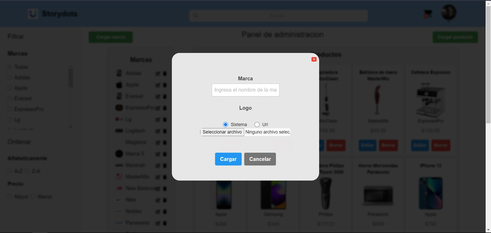
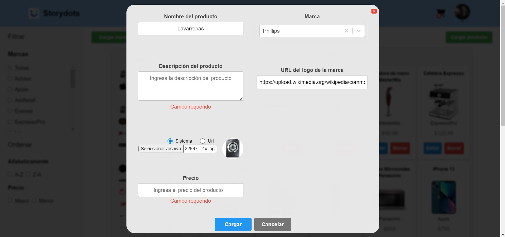

# Prueba técnica - StoryDots

# FRONTEND

---

### Indice:

<ul>
<li> <a href="#intro">- Intro</a>
 <li><a href="#obj">- Objetivos del Proyecto</a></li>
 <li><a href="#stack">- Stack de tecnologias</a></li>
 <li><a href="#instrucciones">- Instrucciones para comenzar</a></li>
 </li>
 <br>
 <li><a href="#home">- Home page</a></li>
<li> <a href="#admin">- Panel de administracion</a>

<ul>

<span id="intro"></span>

## Intro

En este coding challenge te vamos a proponer construir las bases de lo que luego podría transformarse en un ecommerce.

<span id="obj"></span>

### Objetivos del Proyecto:

Vas a construir el frontend en React que muestre los productos que expone tu API en el backend. Podés usar solo React o Nextjs, lo que más te guste está bien :)

Tu tarea es construir un frontend que va a cargar una lista de productos desde el backend, y debe mostrar todos los que haya. Podés elegir paginar los resultados o hacer scroll infinito. Además, al hacer click en un producto el usuario debe poder ver una vista de detalle de ese producto, ya sea un modal en esa misma home o una página dedicada para el producto.

En el listado de productos, debe mostrarse la imagen, el nombre y el precio del producto. En la vista de detalle debe mostrarse, además, la descripción del producto.
Extras
Podés implementar una vista de “administrador” donde permitirle al usuario realizar todas las operaciones CRUD desde el frontend. Otro extra posible para este punto es solamente mostrar la vista de admin luego de que el usuario se logee con contraseña.
Si completaste el extra 2. en el backend, podés mostrar también información de la marca (por ejemplo el logo) en la vista de los productos.

<span id="stack"></span>

### Stack

- React.js
- Tailwind CSS
- Redux Toolkit
- Git
  <span id="intro"></span>

<span id="instrucciones"></span>

### Iiniciar:

- Instalar dependecias ingresando en nuestro terminal el comando:

```bash
- npm install

```

- Inicializar ingresando el comando:

```bash
- npm run dev

```

<span id="recorrido"></span>

## Recorrido:

<span id="home"></span>

### Homepage:

- Al comenzar nos encontramos con la homepage donde podemos ver una grilla con los productos del ecommerce, donde se renderizaran 8 por pagina con su respectivo paginado en la parte inferior.
- En la parte izquierda nos encontraremos con la sidebar la cual podremos filtrar por las marcas encontradas y ordenar por precio (mayor/menor) y alfabeticamnete (a-z / z-a)
- En la parte superior tenemos una Navbar la cual tiene el logo de la pagina que redirige siempre a la homepage, un buscador de productos, un carrito de compras donde se mostraran la cantidad de productos en el mismo y un boton de ingresar.

<p align="left"><p>

- Al clickear el carro de compras podemos er el listado de productos que tenemos en el mismo. Con la posibilidad de eliminar items individualmente o vaciar todo el carro, ademas tenemos informacion del total de los productos del carro y el boton de pago donde para poder acceder a el tendremos que estar logueados, sino lo estamos nos llevara a loguear y luego podremos simular el pago de neustro carrito. Cabe destacar que el contenido de neustro carro queda guardado en el almacenamiento local lo que no nos tendremos que preocupar si cerramos la página, etc.
<p align="left"><p>

- Luego de loguarse podemos ver nuestra foto de cuenta, la cual si la clickeamos podemos er el menu de usuario el cual nos da acceso al panel de administracion y el boton de salir el cual nos deslogueamos.
<p align="left"><p>

- Al clickear sobre un producto se nos desplegara la informacion del mismo con la posibilidad de agregarlo al carrito nueamente

<p align="left"><p>

<span id="admin"></span>

### Panel de administracion:

- La misma Navbar en la parte superior.
- Al ingresar podemos ver dos botones para crear nueva marca o producto lso cuales nos despliega un formulario para cada uno.
- A la izqueirda podemos ver todas las marcas cargadas con la posibilidad de editarlas/eliminarlas.
- a la derecha la grilla de productos cargados con la posibilidad de editarlos/ eliminarlos.
<p align="left"><p>

- Al cargar/ editar una marca se nos abre el siguiente formulario, al editar aparecen los datos precargados con algunas validaciones de nombre/url.

<p align="left"><p>

- Al cargar/editar un producto se nos abre el siguiente formulario, al editar aparecen los datos precargados con algunas validaciones de nombre/url, En el apartado de marcas nos aparece un selector para elegir una marca ya cargada o podemos tipear el nombre de una nueva.
<p align="left"><p>
